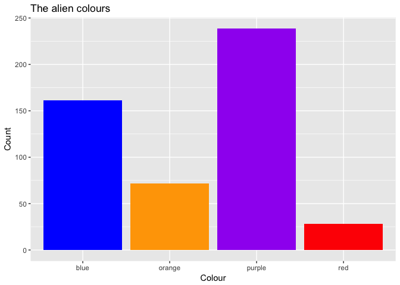
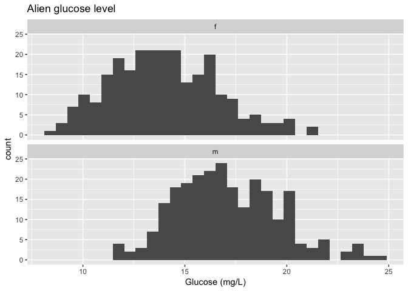
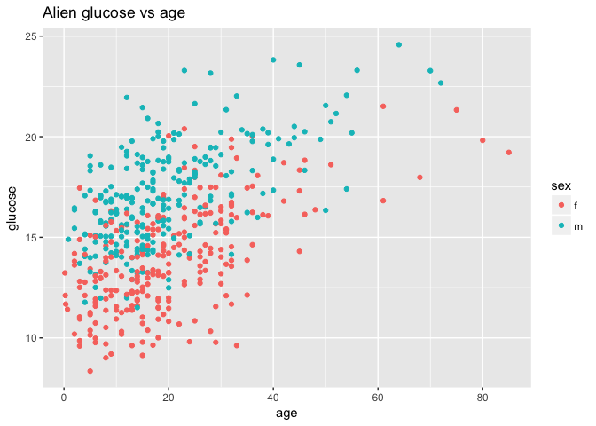
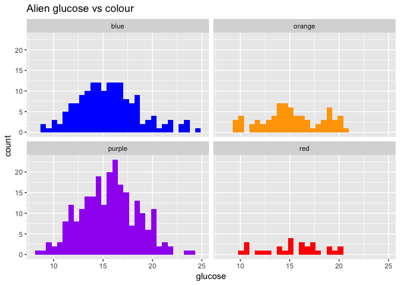
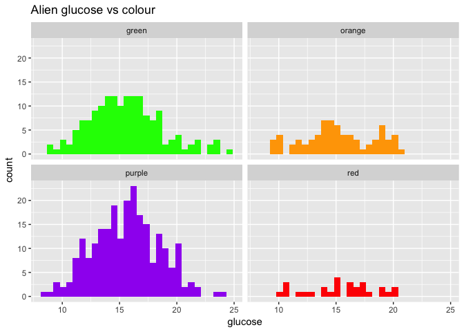
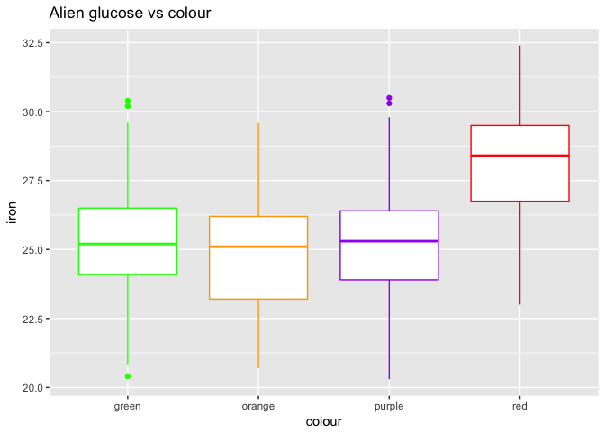
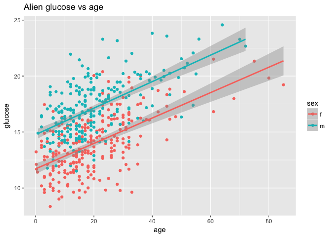
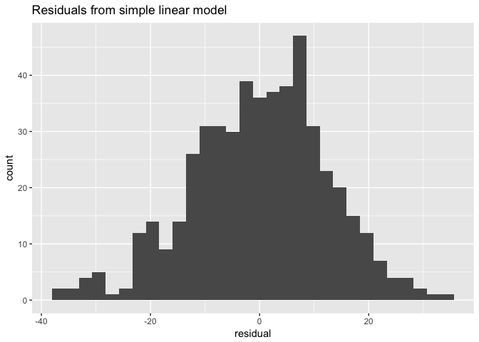

(Install) and load 'add-in' packages


```r
# install these packages if they are not already there...
if (!require("here")) install.packages("here")
if (!require("skimr")) install.packages("skimr")

# load main packages for this analysis
library(tidyverse) # to tidy, manipulate and explore data
library(readxl) # to import data from Excel
library(here) # to make referring to files and folders consistent
library(skimr) # nice quick summaries of data sets
```

### Import data


```r
alien_file <- here("data", "data_alien-observational-untidy_20180310.xlsx")
alien <- read_excel(alien_file, sheet = 1, na = "*")
skim(alien)
```

```
## Skim summary statistics
##  n obs: 500 
##  n variables: 9 
## 
## Variable type: character 
##           variable missing complete   n min max empty n_unique
##                age       0      500 500   1   9     0       66
##       alien colour       0      500 500   3   6     0        8
##             health       0      500 500   6  15     0        4
##               iron      24      476 500   2   4     0       97
##  sex (male/female)       0      500 500   1   6     0        6
## 
## Variable type: numeric 
##                      variable missing complete   n   mean     sd     p0
##                       glucose       0      500 500  15.53   2.99   8.35
##  IQ - ref to human 100 scale!       0      500 500 518.16 108.72 331   
##                       subject       0      500 500 250.5  144.48   1   
##                        weight       0      500 500 100.7   16.95  47.99
##     p25 median    p75    p100     hist
##   13.34   15.5  17.45   24.57 ▁▃▆▇▆▃▁▁
##  445     500.5 574    1033    ▃▇▆▂▁▁▁▁
##  125.75  250.5 375.25  500    ▇▇▇▇▇▇▇▇
##   90.8   102.4 111.78  144.16 ▁▁▃▆▇▆▃▁
```

Use `View (alien)` to eyeball the data too.

### Tidy and clean data

Make subject a 'text' id rather than a number, padding with zeros.


```r
alien <- alien %>%
  mutate(
    subject = str_pad(subject, width = 3, side = "left", "0"),
    subject = str_c("A", subject)
  )
```

Rename columns that don't follow good naming 'rules'


```r
alien <- alien %>%
  rename(
    colour = `alien colour`,
    sex = `sex (male/female)`,
    IQ = `IQ - ref to human 100 scale!`
  )
```

Have a look at the colours...


```r
alien %>%
  count(colour)
```

```
## # A tibble: 8 x 2
##   colour     n
##   <chr>  <int>
## 1 green    124
## 2 Green     37
## 3 orange    60
## 4 Orange    12
## 5 purple   195
## 6 Purple    44
## 7 red       24
## 8 Red        4
```


`colour` column has mixed capitalisation - make all lower case


```r
alien <- alien %>%
  mutate(colour = str_to_lower(colour))
```

Have a look at the sexes...


```r
alien %>%
  count(sex)
```

```
## # A tibble: 6 x 2
##   sex        n
##   <chr>  <int>
## 1 F         33
## 2 female   199
## 3 Female    19
## 4 m         27
## 5 male     196
## 6 MALE      26
```

Make sexes all 'm' or 'f' using first letter


```r
alien <- alien %>%
  mutate(
    sex = str_sub(sex, 1, 1),
    sex = str_to_lower(sex)
  )
```

Convert 'months' to 'years'


```r
alien <- alien %>%
  mutate(age = if_else(str_detect(age, "months"),
    parse_number(age) / 12,
    parse_number(age)
  ))
```

See how data looks so far...


```r
skim(alien)
```

```
## Skim summary statistics
##  n obs: 500 
##  n variables: 9 
## 
## Variable type: character 
##  variable missing complete   n min max empty n_unique
##    colour       0      500 500   3   6     0        4
##    health       0      500 500   6  15     0        4
##      iron      24      476 500   2   4     0       97
##       sex       0      500 500   1   1     0        2
##   subject       0      500 500   4   4     0      500
## 
## Variable type: numeric 
##  variable missing complete   n   mean     sd     p0    p25 median    p75
##       age       0      500 500  19.79  13.19   0.17  11      17    26   
##   glucose       0      500 500  15.53   2.99   8.35  13.34   15.5  17.45
##        IQ       0      500 500 518.16 108.72 331    445     500.5 574   
##    weight       0      500 500 100.7   16.95  47.99  90.8   102.4 111.78
##     p100     hist
##    85    ▅▇▅▂▁▁▁▁
##    24.57 ▁▃▆▇▆▃▁▁
##  1033    ▃▇▆▂▁▁▁▁
##   144.16 ▁▁▃▆▇▆▃▁
```

Make `iron` column into a number


```r
alien <- alien %>%
  mutate(iron = parse_number(iron))
```

Finally sort by subject ID

```r
alien <- alien %>% 
  arrange(subject)
```


Data now looks to be 'tidy and clean'. Next some exploratory analysis...

### Explore categorical data

Tabulate colour...

```r
alien %>%
  count(colour)
```

```
## # A tibble: 4 x 2
##   colour     n
##   <chr>  <int>
## 1 green    161
## 2 orange    72
## 3 purple   239
## 4 red       28
```

Tabulate colour vs sex...

```r
alien %>%
  count(colour, sex)
```

```
## # A tibble: 8 x 3
##   colour sex       n
##   <chr>  <chr> <int>
## 1 green  f        84
## 2 green  m        77
## 3 orange f        39
## 4 orange m        33
## 5 purple f       111
## 6 purple m       128
## 7 red    f        17
## 8 red    m        11
```

### Explore numerical data

Mean glucose level

```r
alien %>%
  summarise(mean(glucose))
```

```
## # A tibble: 1 x 1
##   `mean(glucose)`
##             <dbl>
## 1            15.5
```

Mean and sd glucose

```r
alien %>%
  summarise(
    mean(glucose),
    sd(glucose),
    min(glucose),
    max(glucose)
  )
```

```
## # A tibble: 1 x 4
##   `mean(glucose)` `sd(glucose)` `min(glucose)` `max(glucose)`
##             <dbl>         <dbl>          <dbl>          <dbl>
## 1            15.5          2.99           8.35           24.6
```

How about seeing if there's a sex difference?

```r
alien %>%
  group_by(sex) %>%
  summarise(
    mean(glucose),
    sd(glucose),
    min(glucose),
    max(glucose)
  )
```

```
## # A tibble: 2 x 5
##   sex   `mean(glucose)` `sd(glucose)` `min(glucose)` `max(glucose)`
##   <chr>           <dbl>         <dbl>          <dbl>          <dbl>
## 1 f                14.0          2.62           8.35           21.5
## 2 m                17.1          2.50          11.5            24.6
```


### Some graphics

Plot to show frequency of different spottinesses

```r
ggplot(alien) +
  aes(x = health, fill = health) +
  geom_bar() +
  labs(
    title = "The alien health",
    x = "Health",
    y = "Count"
  )
```

<!-- -->

Plot to show frequency of different colours...

```r
ggplot(alien) +
  aes(x = fct_reorder(colour, colour, length), fill = colour) +
  geom_bar() +
  scale_fill_identity() +
  labs(
    title = "The alien colours",
    x = "Colour",
    y = "Count"
  )
```

<!-- -->

Single numerical variables. Look at glucose levels...

```r
ggplot(alien) +
  aes(x = glucose) +
  geom_histogram() +
  facet_wrap(~ sex, ncol = 1) +
  labs(
    title = "Alien glucose level",
    x = "Glucose (mg/L)"
  )
```

```
## `stat_bin()` using `bins = 30`. Pick better value with `binwidth`.
```

<!-- -->

Scatterplot - age vs glucose

```r
ggplot(alien) +
  aes(x = age, y = glucose, colour = sex) +
  geom_point() +
  labs(title = "Alien glucose vs age")
```

<!-- -->


Glucose levels for different colours


```r
ggplot(alien) +
  aes(x = glucose, fill = colour) +
  geom_histogram() +
  facet_wrap(~ colour) +
  scale_fill_identity() +
  labs(title = "Alien glucose vs colour")
```

```
## `stat_bin()` using `bins = 30`. Pick better value with `binwidth`.
```

<!-- -->


```r
ggplot(alien) +
  aes(x = colour, y = iron, fill = colour) +
  geom_boxplot(alpha = 0.25) +
  scale_fill_identity() +
  labs(title = "Alien iron vs colour",
       x = "Alien colour",
       y = "Iron (ug/L)")
```

```
## Warning: Removed 24 rows containing non-finite values (stat_boxplot).
```

<!-- -->


### A hypothesis test

Does the mean weight of male aliens differ from that of female aliens?

First a plot...

```r
ggplot(alien) +
  aes(x = weight) +
  geom_histogram() +
  facet_wrap(~ sex, ncol = 1)
```

```
## `stat_bin()` using `bins = 30`. Pick better value with `binwidth`.
```

<!-- -->

Then a T-Test (nulL hypothesis mean(female) == mean(male))


```r
t.test(weight ~ sex, data = alien)
```

```
## 
## 	Welch Two Sample t-test
## 
## data:  weight by sex
## t = -11.856, df = 491.47, p-value < 2.2e-16
## alternative hypothesis: true difference in means is not equal to 0
## 95 percent confidence interval:
##  -18.51261 -13.24899
## sample estimates:
## mean in group f mean in group m 
##        92.79124       108.67204
```

### Finally a statistical 'model'

How does weight change with age and sex

First a plot...

Scatterplot - age vs glucose - with fitted lines

```r
ggplot(alien) +
  aes(x = age, y = glucose, colour = sex) +
  geom_point() +
  geom_smooth(method = "lm") +
  labs(title = "Alien glucose vs age")
```

<!-- -->

Then a simple linear model with age and sex as predictors...


```r
mod <- lm(weight ~ age + sex, data = alien)
```


```r
summary(mod)
```

```
## 
## Call:
## lm(formula = weight ~ age + sex, data = alien)
## 
## Residuals:
##     Min      1Q  Median      3Q     Max 
## -37.069  -8.242   0.781   8.327  34.095 
## 
## Coefficients:
##             Estimate Std. Error t value Pr(>|t|)    
## (Intercept) 80.35680    1.16142   69.19   <2e-16 ***
## age          0.62266    0.04256   14.63   <2e-16 ***
## sexm        16.10747    1.12167   14.36   <2e-16 ***
## ---
## Signif. codes:  0 '***' 0.001 '**' 0.01 '*' 0.05 '.' 0.1 ' ' 1
## 
## Residual standard error: 12.54 on 497 degrees of freedom
## Multiple R-squared:  0.4547,	Adjusted R-squared:  0.4526 
## F-statistic: 207.3 on 2 and 497 DF,  p-value: < 2.2e-16
```

```r
res <- residuals(mod)


qplot(res) +
  labs(
    title = "Residuals from simple linear model",
    x = "residual"
  )
```

```
## `stat_bin()` using `bins = 30`. Pick better value with `binwidth`.
```

<!-- -->


