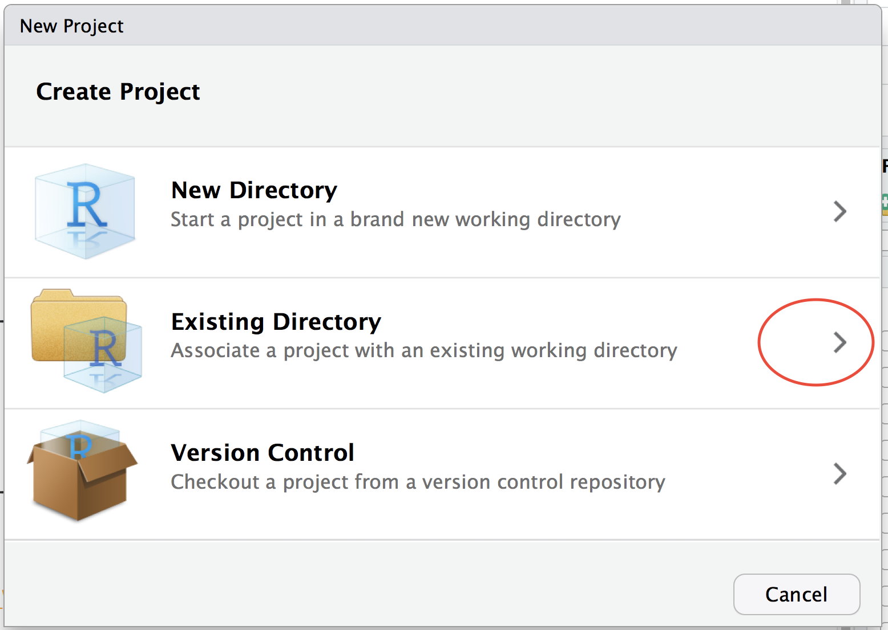
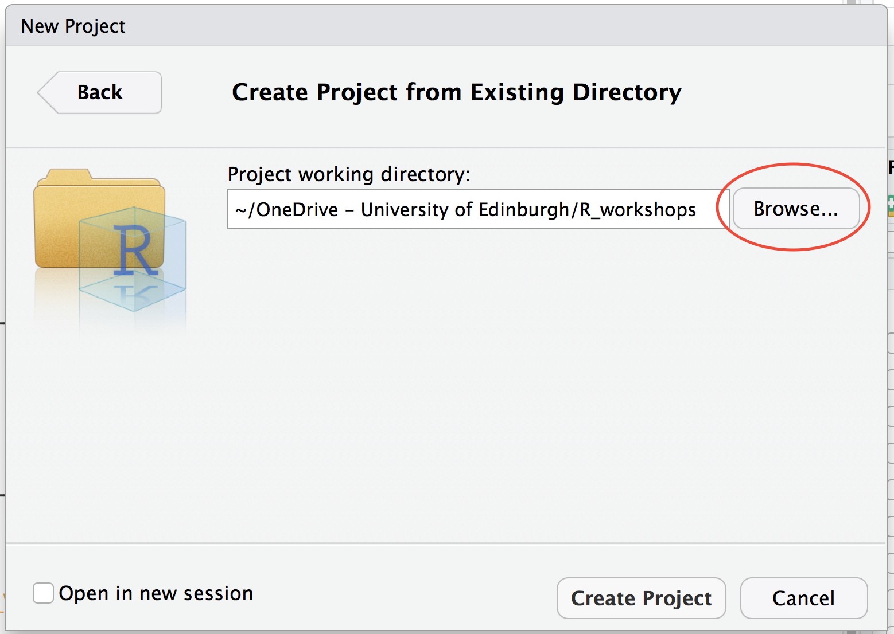
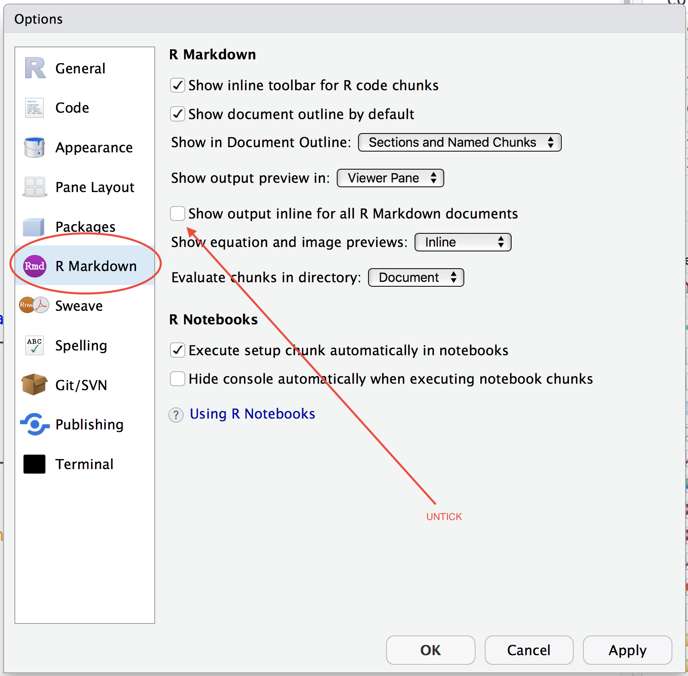

```{r, include = FALSE}
library(knitr)
knitr::opts_chunk$set(echo = FALSE, out.width = 300)
```


### Create a folder for the project and add data...

Using Windows file explorer or Mac finder

1. Create a folder on your computer
2. Copy the **aliendata_20180404.xlsx** file into the folder from the email I sent today or this dropbox link https://bit.ly/2H1f1Nk

### Now, using RStudio…

1. Menu File > New Project


```{r}

```

2. Choose "Existing directory"
3. Click "Browse" and find the folder/directory you set up earlier

```{r}

```

4. Click "open" in the browsing window and then "Create Project"
5. Click on menu: Session > Set working directory > To project directory^[This is only necessary on IS managed lab computers - on your own computer RStudio will automatically set itself to work from the project] 
6. Click on menu: Tools > Global options
7. Then Select "RMarkdown"" on the left and make sure that you have the "Show output inline..." option UNTICKED

```{r}

```


